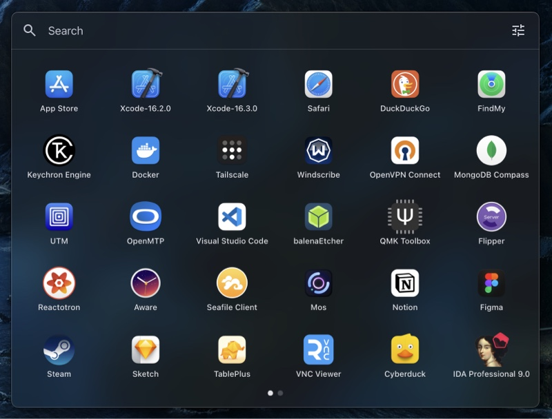
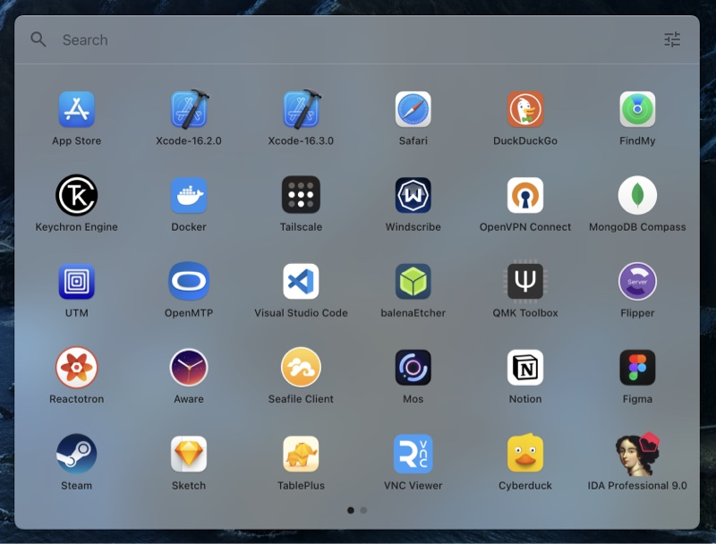
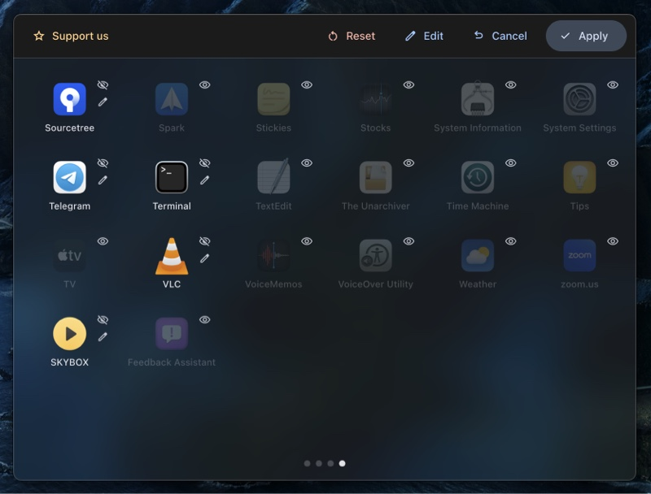
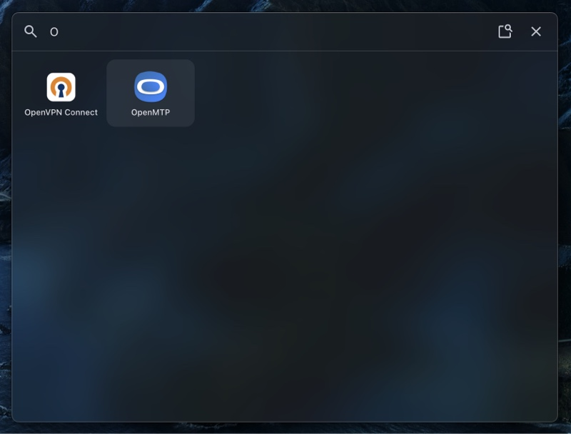

# Better Launchpad

A smarter, free, and highly customizable application launcher for macOS with fast search.

## Why Better Launchpad?

The standard macOS Launchpad can be slow and lacks customization. Better Launchpad is designed to be fast, more powerful, and tailored to your workflow.

## ✨ Features

- **🚀 Search**: Find and launch any app in milliseconds.
- **⌨️ Keyboard Navigation**: Navigate through apps with arrow keys and launch with Enter. No need to touch the mouse. Just start typing the name of the app to search.
- **🎨 Customizable Layout**:
  - **Reorder Apps**: Drag and drop apps to create your perfect layout.
  - **Hide Apps**: Declutter your view by hiding apps you don't use often.
  - **Custom Icons**: Change an app's icon to personalize your grid.
- **🌍 Multi-language Support**: Available in many popular languages.
- **💸 Free Forever**: Better Launchpad is completely free and ad-free.

## 💾 Installation

You can download the latest version of Better Launchpad from the [releases page](https://github.com/rewhex/better-launchpad/releases).

Download the `.dmg` file for your system, choose either for Intel Macs or Apple Silicon, open it, and drag `Better Launchpad.app` to your `Applications` folder.

## 🤝 Contributing

Contributions are welcome! Whether it's reporting a bug or suggesting a feature, your help is appreciated.

Feel free to open an [issue](https://github.com/rewhex/better-launchpad/issues).

## 🖼️ Screenshots

